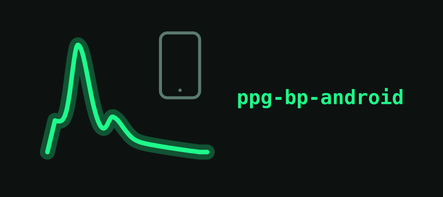

# ppg-bp-android

<p align="center">
  
</p>

Native Kotlin app that records raw PPG + motion data from a Polar Verity Sense over BLE, stages it on-device, and syncs it to a self-hosted server when it can. Part of a three-repo project for estimating blood pressure trends from raw PPG in cases that need per-person calibration, such as the autonomic BP instability seen in Multiple System Atrophy (MSA).

Not a medical device. Read [DISCLAIMER.md](DISCLAIMER.md) before using this for anything real.

## What it does

The app connects to a Polar Verity Sense and streams PPG (176 Hz, 4-channel), accelerometer, and gyroscope (up to 416 Hz) via the Polar BLE SDK. Raw samples are written to disk as rotating per-sensor files (ROP format, see `ppg-bp/docs/design/raw_rop_storage.md`), so a crash loses at most one rotation window, not the whole session.

It also pairs with and reads an Omron blood pressure cuff over BLE (reverse-engineered protocol, since the cuff has no public API) to collect calibration data. Recording is fully offline; staged bundles sync to a server over HTTP whenever one is reachable, with no cloud dependency and no requirement to be online while recording. A foreground service keeps recording alive when the app goes to background.

## Why native Kotlin, not a cross-platform framework

The Polar BLE SDK is Kotlin/Java-first. Background BLE streaming reliability on Android already has enough sharp edges (service lifecycle, battery optimization killing connections, GATT callback threading) without adding a cross-platform bridge on top of it.

## Architecture

```
[Polar Verity Sense]
       │ BLE (Polar BLE SDK)
       ▼
[PolarRepository] — owns the connection, one coroutine per sensor stream
       │
       ▼
[SessionWriter] — packs samples into per-sensor ROP files, rotates on a timer
       │
       ▼
[on-device storage] — app-private external files dir, no runtime storage permission needed
       │
       ▼ (WorkManager, opportunistic)
[SyncWorker / CuffSyncWorker] — HTTP upload to the server, resumable per-file
```

Each sensor's BLE stream startup is wrapped in a retry-with-backoff loop, not a bare `try/catch`. This exists because of a real bug: a transient failure in the stream-settings request killed a sensor's coroutine silently for the rest of a 6-hour session, with the UI counters for the *other* sensors still climbing normally. Nothing crashed, nothing logged an error the user would see — the session just quietly had a gyroscope and no PPG. If you're touching `PolarRepository`, keep the retry wrapper.

## Debug harness

A debug-only source set (`src/debug/`, excluded from release builds) exposes an ADB broadcast interface to drive the app without touching the UI — useful for wireless-ADB testing where you don't have a screen in front of you:

```bash
adb shell am broadcast -a com.polarppgbp.debug.START_RECORDING --es profile calibration --es device_id <your-polar-serial>
adb shell am broadcast -a com.polarppgbp.debug.STOP_RECORDING
adb shell am broadcast -a com.polarppgbp.debug.STATUS
adb shell am broadcast -a com.polarppgbp.debug.SYNC_NOW
adb shell am broadcast -a com.polarppgbp.debug.SET_SERVER --es url http://<host>:8000 --es token <token>
adb shell am broadcast -a com.polarppgbp.debug.PAIR_CUFF
adb shell am broadcast -a com.polarppgbp.debug.READ_CUFF
```

## Configuring your own device

The app needs a Polar device ID to auto-connect to on startup. It never ships with a real device ID hardcoded. Set one of:

- **Recommended:** pair once through the UI, or send a `SET_SERVER`/`device_id` debug broadcast (see above) — the app remembers it in `SharedPreferences` from then on.
- **Build-time default:** add `defaultDeviceId=<your-polar-serial>` to your local, gitignored `local.properties`, or pass `-PdefaultDeviceId=<your-polar-serial>` to Gradle. This becomes `BuildConfig.DEFAULT_DEVICE_ID`, used only as a fallback when no device has been paired yet.

If neither is set, the recording service logs a warning and refuses to start rather than silently doing nothing.

Logs: `adb logcat -s PolarRepo SyncWorker CuffSyncWorker DebugCmd`

## Status

| Component | State |
|---|---|
| BLE capture: PPG 176 Hz, ACC/GYRO 416 Hz | Done. Verified against real hardware, resilient stream startup. |
| Rotating ROP file writer | Done. Crash-safe. |
| Omron cuff pairing and read | Done. Real bonding quirks handled, see the cuff protocol doc. |
| Offline-first recording, opportunistic HTTP sync | Done. Session bundles and cuff readings. |
| ADB debug command harness | Done. |
| Foreground-notification UX | In progress. Polish pending. |
| Automatic posture tagging from accelerometer | Not started. Data is captured; tagging isn't wired up in the app yet. |

## Required hardware

This app targets specific devices. Used as-is, with no code changes, you need all of the following:

| Item | Model | Why this specific one |
|---|---|---|
| PPG sensor | **Polar Verity Sense** | The only sensor the capture path targets: 176 Hz, 22-bit, 4-channel raw PPG plus 416 Hz ACC/GYRO over the Polar BLE SDK. Other Polar devices (H10, OH1) speak the same PMD protocol and may partly work, but are untested here. |
| BP cuff | **Omron Evolv (HEM-7600T / BP7000)** | Calibration reference. Its BLE protocol is reverse-engineered and model-specific — other Omron models use different EEPROM layouts and record encodings, and will not work unmodified. |
| Phone | **Android 13+** (`minSdk 33`) with BLE | Required by Polar BLE SDK 7.0+. Developed and tested against a OnePlus 9 Pro on Android 14 (API 34). |
| Server | A machine on your network | Sync target. Sizing and specs: [ppg-bp-server](https://github.com/EliasVahlberg/ppg-bp-server#hardware-and-sizing). |

A cuff is not optional for BP estimation. PPG gives you waveform morphology, not pressure — without paired cuff readings there is nothing to calibrate against, and the app will only ever be a raw-signal recorder.

## Building

```bash
cd android
export ANDROID_HOME=/path/to/Android/Sdk
./gradlew :app:assembleDebug
adb install -r app/build/outputs/apk/debug/app-debug.apk
```

## License

MIT — see [LICENSE](LICENSE).
